<div style="text-align: justify">
Olá! Que tal aprender um pouco sobre como utilizar a ferramenta git para controle de versão em projetos?

#### O QUE É GIT?

Primeiramente, não podemos confundir `git` e `GitHub`, são coisas distintas.

O `git` é um projeto open-source para controle de versionamento muito utilizado por desenvolvedores e criado no ano de 2005 por Linus Tordvalds, criador do kernel do sistema operacional Linux. 

Mais objetivamente, o `git` é uma ferramenta que pode ser utilizada para controlar as alterações de um projeto, sendo possível com ele manter um histórico de todas as alterações realizadas, sendo possível retroceder para qualquer `ponto da historia` em caso de necessidade. 

Quando o git é inicializado no repositório de um projeto, possibilita a partir da linha de comando ou usando uma GUI - Guided User Interface, criar `pontos na historia` e `ramificações` do seu projeto, que são importantes para entender o que de fato é está poderosa ferramenta e como utiliza-la. 

`Ramificações` são uma copia de todo ou parte do projeto, de modo que o desenvolvedor possa trabalhar em cima dessa copia realizando as modificações necessárias sem que isso afete os arquivos que estão no repositório principal.

Sempre que alterações realizadas em arquivos que estejam sendo monitorados pelo git forem "commitadas", elas estarão disponíveis no log da ramificação - ou branch, e será possível retroceder para esses pontos, caso seja necessário.  

> `Ramificações` (ou `branches`) possibilitam aos desenvolvedores alterarem os arquivos do projeto de forma independente, sem que isso afete os arquivos principais. Pode-se pensar em um `branch` como sendo uma copia do diretório em que se deseja trabalhar.

Ao terminar de trabalhar nas `branches`, são realizados os `commits`, que podem ser vistos como "`pontos na historia`". São uma "fotografia" de como os arquivos estavam naquele momento. Caso seja necessário, será possível retornar a esses estados.

A seguir iremos ver como utilizar o `git` para realizar o controle de versão de nossos projetos a partir da linha de comando e como conectar o `git` em nossa maquina com a nossa conta no `GitHub`, realizando as operações de push pela linha de comando.

##### O QUE É GITHUB

`GitHub` é um serviço online de hospedagem de repositórios. Ele permite que os desenvolvedores mantenham todos os commits sincronizados entre os membros do time.

A seguir iremos criar um repositório local, inicializar o git no repositório, realizar o `commit` de um arquivo e realizar o envio dos arquivos para o nosso repositório no `GitHub`.

##### INSTALANDO O GIT

Para instalar o git em sua maquina, siga as instruções em https://git-scm.com/downloads.

##### INICIALIZANDO O GIT EM UM REPOSITÓRIO LOCAL

Primeiramente, iremos inicializar o git em um repositório no qual estamos trabalhando. Utilizando a sua linha de comando: `git init`.

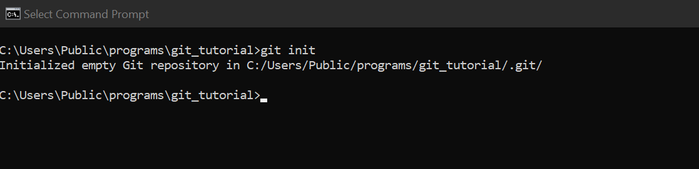

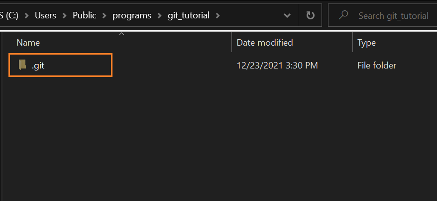

Sempre que inicializamos o git em um repositório, é criado um arquivo do tipo ".git". É nesse arquivo que ficarão armazenados todas as informações necessárias para a realização do controle de versionamento.

##### O COMANDO GIT STATUS

O comando `git status` é utilizado constantemente para verificar se existem novos commits a serem realizados. 

Basicamente ele te informara se existem arquivos no seu repositório que foram alterados e ainda não passaram por um commit, ou se existem arquivos na "Staging Area", que nada mais são do que arquivos que foram adicionados pelo usuário para fazerem parte do proximo commit (ou ponto na historia).


Como o nosso repositório ainda não possui nenhum arquivo, o git status nos informou que além de nosso projeto ainda não possuir nenhum `commit`, não existem arquivos para serem "commitados".

Vamos agora adicionar um arquivo .txt e verificar novamente o `git status`.

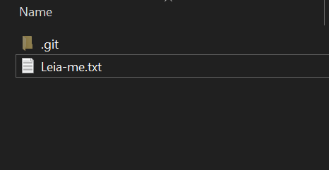

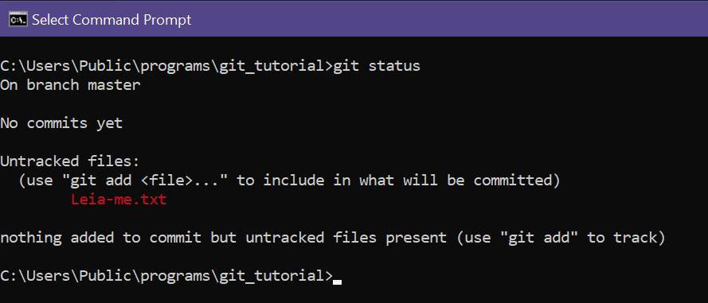

Agora ao utilizar o comando `git status` é possível verificar que existe um arquivo em nosso repositório com alterações não rastreadas. 

##### REALIZANDO O PRIMEIRO COMMIT

Para rastrear o novo arquivo que criamos em nosso diretório, primeiro usaremos o comando `git add <nome do arquivo>` para adicionar nosso arquivo na Staging Area.

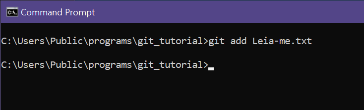

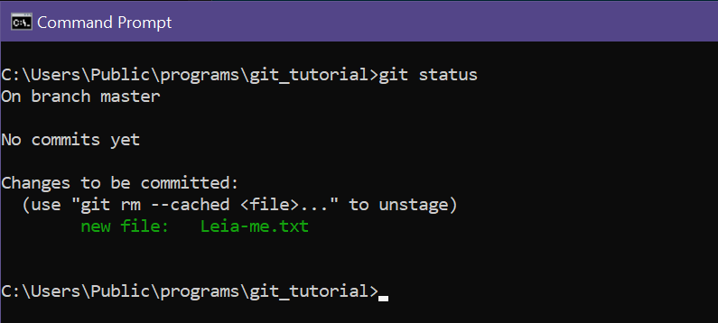

Agora ao utilizar o comando `git status`, é possível verificar que o arquivo Leia-me.txt foi adicionado para `commit` na Staging Area com alterações a serem rastreadas.

Vamos agora realizar o primeiro commit do nosso repositório. Vamos utilizar o comando `git commit -m <"descrição do commit">`.

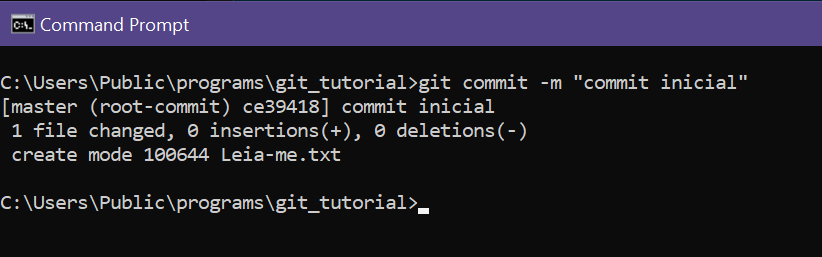

Pronto, o arquivo Leia-me.txt agora está rastreado. Sempre que novas alterações forem feitas ao arquivo, será necessário realizar novos `commits` para rastrear as novas alterações. 

Agora, ao verificar o comando `git status`, é possível verificar que o arquivo Leia-me.txt não está mais aparecendo. 

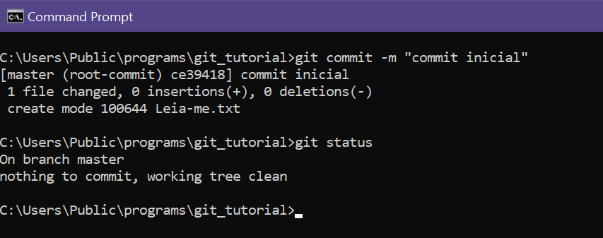

##### O COMANDO GIT LOG

Para verificar o nosso histórico de commits, utiliza-se o comando `git log`:

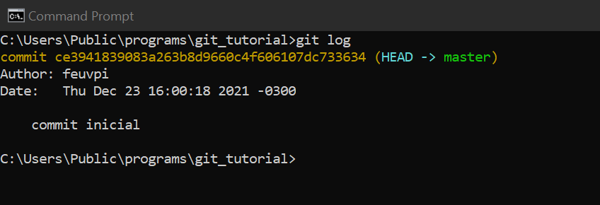

Podemos verificar que existe um `commit` realizado no nosso projeto (o que acabamos de realizar). É possível verificar a data, o autor e a descrição do `commit`. Perceba que logo após o código do commit em amarelo, é indicado que o commit foi realizado direto no branch principal (master).

Antes de partimos para os branches e para entendermos de uma vez a utilização dos comandos `git commit`, `git add` e `git status`, vamos incluir um texto qualquer no nosso arquivo .txt e vamos realizar um novo `commit`:

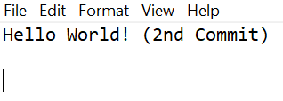

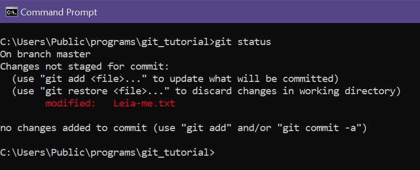

Agora o comando `git status` nos informa que existem alterações não rastreadas no nosso arquivo .txt. Clareou? Sempre que possuirmos arquivos em seu repositório com alterações não rastreadas pelo git, o comando `git status` irá te informar. Agora vamos utilizar os comandos `git add` e `git commit` novamente e realizar nosso segundo `commit`.

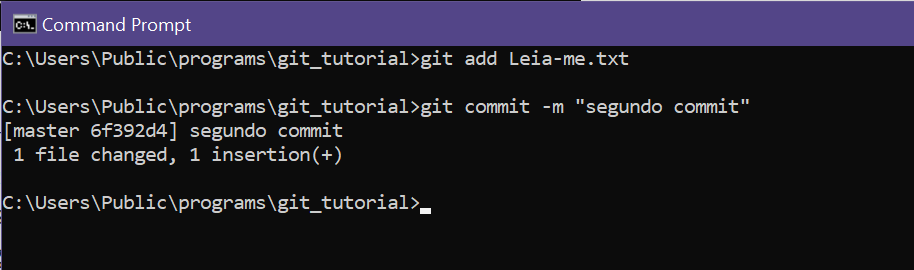

> **IMPORTANTE**: O comentário dos commits devem conter uma descrição das principais alterações introduzidas nos arquivos que estamos rastreando, de forma clara e objetiva. Pode ser algo como "realizado alteração 'A' para solucionar o problema 'B'". Isso será importante para que no futuro outros desenvolvedores e até nos possam identificar as alterações realizadas.

##### ENTENDENDO O QUE SÃO BRANCHES

Branches nada mais são do que "copias" do nosso diretório que permitem-nos trabalhar no projeto sem que as alterações realizadas afetem os arquivos no "branch" principal (master). 

Desse modo, o arquivos podem ser alterados sem que se corra o risco de "bagunçar" o nosso projeto original caso algo dê errado. 

Apenas apos todas as alterações tiverem sido concluídas e devidamente testadas, é realizada a junção do da `ramificação` com o `branch` principal. 

A seguir, criaremos um novo `branch` em nosso projeto e então realizaremos uma alteração no nosso arquivo para em seguida realizar um `commit` no nosso novo branch e o `pull` para o `branch` principal.

Para criar um novo branch no seu projeto, utilize o comando `git branch <nome do novo branch>`, sem considerar os colchetes.

> **IMPORTANTE**: Ao criar um branch, não mudamos para ele automaticamente. Utilizaremos o comando `git checkout <new branch name>` para alterara para a nova ramificação.

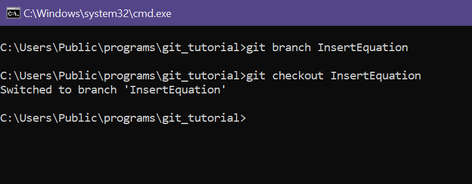

Agora ao usarmos o comando `git status` somos informados que estamos trabalhando no branch "InsertEquation" que acabamos de criar. Isso quer dizer que a partir de agora as alterações que realizarmos nos nossos arquivos não irão impactar o branch principal.

É importante notarmos ainda que como acabamos de realizar a mudança para a nova ramificação e não realizamos nenhum alteração, dessa forma o comando `git status` nos informa que não existem arquivos a serem rastreados.


Agora vamos inserir uma equação no nosso arquivo .txt e realizar um commit no nosso novo branch.

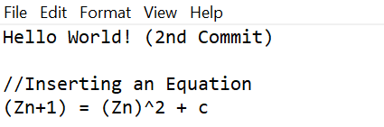

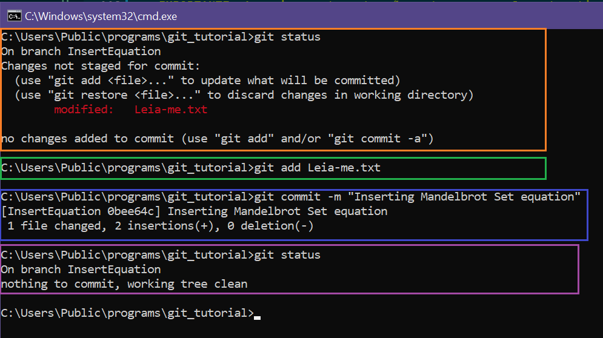

Agora vamos dar uma olhada no `git log` do nosso projeto.

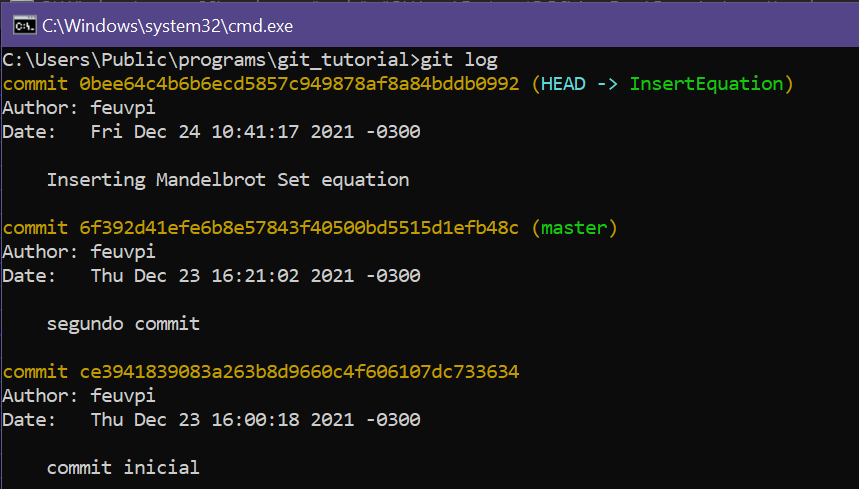

Ja é possível visualizar o nosso terceiro `commit`, mas agora o log nos informa que o `commit` foi realizado no branch `InserEquation`.

Essas alterações ainda não estão no `branch` principal `master` e vamos poder verificar isso agora executando o comando `git checkout master` para voltarmos para o branch principal. Após isso, ao ao abrir o nosso arquivo .txt iremos perceber que a equação do MandelBrot Set que inserimos anteriormente não está mais la.

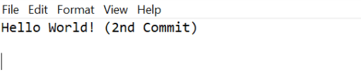

##### FAZENDO A JUNÇÃO DAS ALTERAÇÕES REALIZADAS COM O BRANCH PRINCIPAL

Para finalizar esse post sobre como utilizar a ferramenta `git` para sistema de controle de versão, vamos agora realizar a junção ou "merge" das alterações que realizamos no nosso branch InsertEquation com o branch principal ou "master" utilizando o comando`git merge InsertEquation`

Perceba que agora, continuamos no `master branch` mas o arquivo .txt está atualizado com a equação do Mandelbrot Set que havia sido inserida na outra ramificação. Dessa forma podemos utilizar a ferramenta git em nossa maquina para realizar o controle de versão dos nossos projetos de forma profissional e eficiente.

##### CONECTANDO O NOSSO REPOSITÓRIO LOCAL COM O GITHUB

Para conectar o repositório local com o repositório remoto, utiliza-se o comando `git remote`, definindo um nome para o repositório remoto e informando a sua url:

```
git remote add <name> <url>

```
É importante que previamente o git receba um nome de usuário para associar os commits 

##### ATUALIZANDO O REPOSITÓRIO REMOTO COM AS ALTERAÇÕES DO REPOSITÓRIO LOCAL

Após ter associado a URL de um repositório remoto a um nome, basta utilizar esse nome para realizar os pushes das alterações do nosso repositório local para o remoto:

```
git push <nome>
```

<div style="text-align: right">

###### []'s 