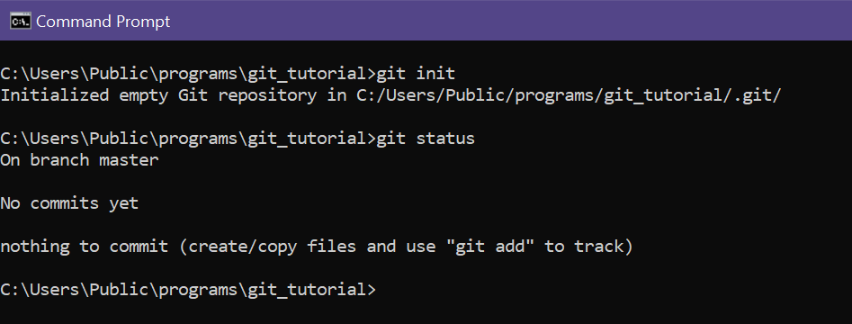
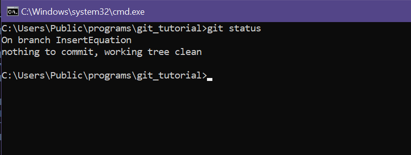

<div style="text-align: justify">

##### Using Git from command line for file tracking and version management. 

#### WHAT IS GIT?

First, we cannot misunderstood `git` with `GitHub`, they are not the same thing.

`Git` is an open-source project widely used by developers for file tracking and peer collaboration. It was created in 2005 by Linus Tordvalds, creator of the Linux operating system, Kernel.

More precisely, `git` is a tool that can be used to allow file-tracking. 

It works by `commits` and `branches`, which are important concepts to gasp what actually is this powerful tool and how to use it properly.

`Branches` can be understood as copies of the project, allowing developers to work on top of it without affecting the original files that are in the main repository.

Whenever any monitored files have changes implemented in them and those changes are committed, they will show up in the branch log making possible to rewind to these points, if necessary.

> `Branches` allow developers to change project files independently, without affecting the main files. We can think of a `branch` as being a copy of the directory we want to work in.

 `Commits` can be seen as "`checkpoints`", or snapshots. They are the state of the files at a certain time, and with git we can make our project go back to those states if we need to. 

Next, we will see how to use `git` to perform file-tracking from the command line and how to connect `git` with our `GitHub` account, performing push operations through CM.

##### WHAT IS GITHUB

`GitHub` is an remote repository hosting service. It also allows developers to keep all commits synchronized between team members.

##### GIT INSTALLATION

To install git on your machine, follow the instructions at https://git-scm.com/downloads.

##### INITIALIZING GIT IN A LOCAL REPOSITORY

First, we should initialize git at the root folder of our repository using the command `git init`:


Whenever we initialize git in a repository, a file of type ".git" is created. It is in this file that all the information necessary to carry out file tracking and versioning control will be stored.

##### CHECKING STATUS

The `status` command is used constantly to check if there is any new files with untracked changes. 



As our repository doesn't have any files yet, there are no files to tracked.

Let's now add a .txt file and check `git status` again.


This time a new file with untracked changes show up. We need to make a commit if we want to track those changes. 

##### COMMITTING CHANGES

To make a commit, we need to add the files we wish to commit to staging area first using the `add` command followed by the file name:


`Git status` can be used to verify that Leia-me.txt has been added for `commit` in the Staging Area.

Now let's commit the file (or files, if there are more than one at staging are to be committed):

```
git commit -m "commit description"

```


Cool, Leia-me.txt is now tracked. Whenever new changes are made to the file, it will be important to make new `commits` if we want to keep tracking it.

Now, when cheking `git status`, there are no files to be staged or committed. 


##### GIT LOG

The command `git log` is used to check commit history: 


We can verify that there is a `commit` performed in our project (which we have just performed). You can check the date, author, and description of the `commit`. Note that right after the commit code in yellow, it is pointed that the commit was carried out directly on the main branch (master).

Before we go to the branches and understand at once the use of the `git commit`, `git add`, and `git status` commands, let's include some text in our .txt file, and perform a new `commit`:


Now the `git status` command tells us that there are untracked changes in our .txt file. Shed light? Whenever we have files in your repository with untracked changes, the `git status` command will inform you, so use it constantly. Now let's use the `git add` and `git commit` commands again and perform our second `commit`.


> **IMPORTANT**: It's important to remember that commit messages should contain a clear description of the main changes being introduced. It might be something like "change 'A' made to solve problem 'B'". That way in future times other developers and even ourselves can easily identify all the changes made.

##### ABOUT BRANCHES

Branches are mere "copies" of our project directories, allowing us to work on them without affecting the files in the main "branch" (master).

In this way, the risk of "messing up" everything if something goes wrong is eliminated. 

Only after all changes have been completed and properly tested, they are merged into the `main branch`. If we are working on  a team in a remote repository like GitHub, we'll need to create a `pull request`.

Next, we'll create a new `branch` in our project, create a change to our txt file, `commit` it to our new branch and `merge` it to the main `branch`.

To create a new branch, use the command `git branch <name of new branch>`, without considering the square brackets.

> **IMPORTANT**: When creating a branch, we do not switch to it automatically. We will use the command `git checkout <new branch name>` to change to the new branch.


Using `git status` we can check that we are working on the "InsertEquation" branch we just created. This means that from now on the changes made to our files will not impact the main branch.

It's also important to note that since we've just made the switch to the new branch and haven't made any changes, the `git status` command tells us that there are no files to track.



Now let's insert an equation into our .txt file and commit it to our new branch.


Now let`s use `git log` to check our change history.


We can already see our third `commit`, and it was implemented on `InserEquation` branch.

Previous changes are not yet implemented at the `main branch` and this can be verified by running the command `git checkout master` to switch to main. Now, when opening the .txt file, it can be noticed that the equation is no longer there.


##### MERGING ONE BRANCH INTO OTHER

It is time to "merge" the changes created in our InsertEquation branch into the main one using the `git merge InsertEquation`.

Note that now the .txt file is updated with the equation that was previously inserted in the branch we just merged. In this way, we can use git to perform file tracking and version control our projects in a professional and efficient manner. 

##### CONECTANDO O NOSSO REPOSITÓRIO LOCAL COM O GITHUB

To connect with a remote repository, use the `git remote` and define a name for the remote repository, and inform the URL or SSH Key provided by the service. 


```
git remote add <name> <URL>

```

##### UPDATING THE REMOTE REPOSITORY 

After associating the URL of a remote repository with a name, just use it to push changes from local repository:

```
git push <name>
```

<div style="text-align: right">

###### []'s 