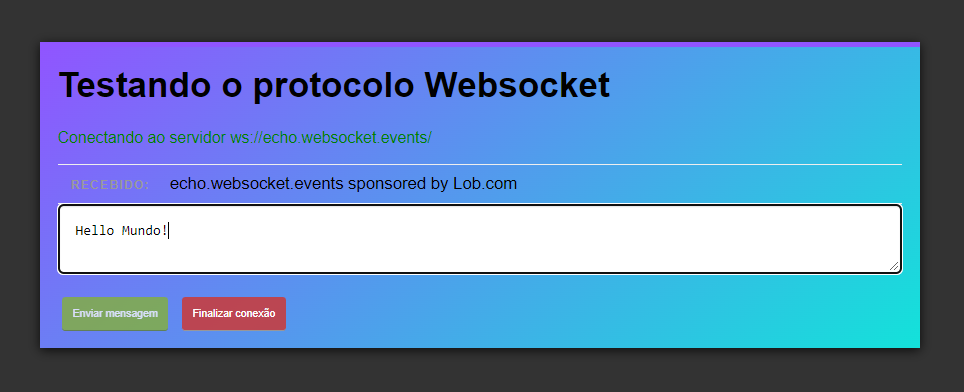
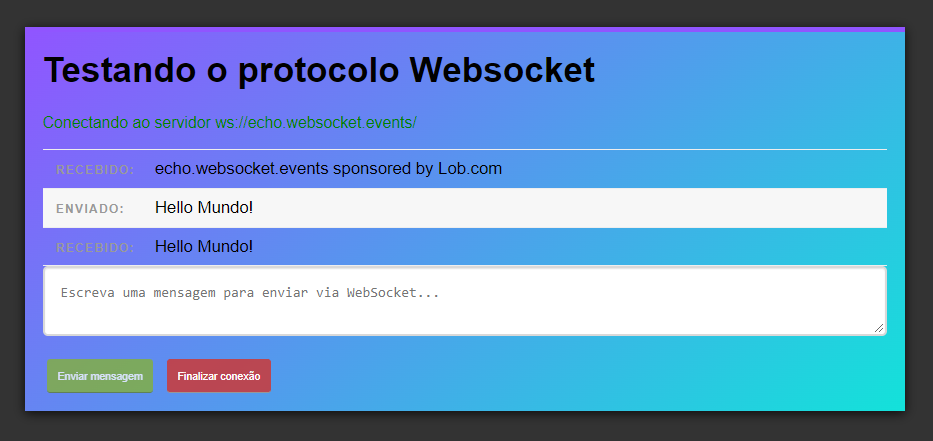

<div style="text-align: justify">

##### Um exemplo rapido e pratico de utilização do protocolo Websocket para comunicação persistente e bi-direcional.

Websocket é um protocolo de comunicação persistente e bidirecional que viabiliza sessões de comunicação interativa entre cliente e servidor, possibilitando o envio de mensagens e o recebimento de respostas orientadas a eventos sem a necessidade de consulta ao servidor. 

Colocando em outras palavras, o protocolo Websocket pode ser utilizado para aplicações que exijam a troca de dados em tempo real, como por exemplo:

  - jogos online
  - chats
  - streaming
  - atualização em tempo real de eventos (dashboards, redes sociais, alertas)

Para esta demonstração estamos utilizando uma interface de front-ent basica para que possamos enviar e visualizar as mensagens encaminhadas pelo servidor. Encontre o codigo completo da demonstração no `GitHub`.

É importante antes de mais nada buscarmos referência de todos os elementos que iremos trabalhar no nossa front-end.

```js
    const form = document.getElementById("input-form");
    const messageField = document.getElementById("message");
    const messageList = document.getElementById("messages");
    const socketStatus = document.getElementById("status");
    const closeBtn = document.getElementById("close");
```

Para utilizarmos o Websocket no lado do cliente, devemos criar um novo objeto `Websocket`:

```js
const socket = new WebSocket("ws://echo.websocket.events")
```
Iremos utilizar o servidor de teste `ws://echo.websocket.events`. Esse servidor irá ecoar tudo que o que for enviado para ele, possibilitando testarmos o funcionamento de nossa aplicação. 

O objeto WebSocket possui algumas funções da callback que iremos utilizar para construir nossa aplicação. 

Utilizaremos a função `onerror` para tratarmos possiveis erros que possam acontecer em nossa aplicação:

```js
socket.onerror = (error) => {
  console.log("WebSocket Error " + error);
}
```

Utilizaremos a função `onopen` para executarmos certas tarefas assim que houver conexão do cliente com o servidor: 

```js
socket.onopen = (evt) => {
  socketStatus.innerHTML = "Conectado ao servidor " + evt.currentTarget.url;
  socketStatus.className = "open";
}
```

Agora estamos informando ao cliente que a aplicação está conectada ao servidor e adicionando a classe `open` ao elemento HTML `<div id="status">`.

Sempre que alguma mensagem for enviada pelo servidor, iremos tratar o evento com a função `onmenssage`:

```js
socket.onmenssage = (evt) => {
  let message = evt.data;
  messageList.innerHTML += '<li class="received"><span>Recebido:</span>'+ message + '</li>';
}
```
Dessa forma, todas as mensagens encaminhadas pelo servidor serão inseridas em nosso front-end como um item de lista.

Sempre que a nossa conexão com o servidor for fechada, utilizaremos a função `onclosed` para tratar o evento:

```js
socket.onclose = (evt) => {
  socketStatus.innerHTML = "WebSocket desconectado.";
  socketStatus.className = "closed";
}
```

Ja criamos uma forma de tratarmos as mensagens encaminhadas pelo servidor, agora vamos criar uma função para enviar as mensagens digitadas no campo de texto para o servidor. 

```js
form.onsubmit = (e) => {
  e.preventDefault();

  // Pegar o value digitado no campo de texto
  let message = messageField.value;

  // Enviar a mensagem pelo WebSocket
  socket.send(message);

  // Adicionar a mensagem enviada no log
  messageList.innerHTML += '<li class="sent"><span>Enviado:</span>' + message + '</li>'

  // Resetar o campo de mensagem
  messageField.value = "";

  return false;
}
```
Além de enviar a mensagem digitada utilizando a função `send` do objeto `WebSocket`, tambem inserimos a mensagem enviada no log da tela e resetamos o campo de mensagem.

Por fim, iremos criar uma função para encerrar a conexão com o servidor.

```js
closeBtn.onclick = (e) {
  e.preventDefault();

  socket.close();

  return false;
}
```
Agora vamos verificar a nosso software em funcionamento. Como nossa aplicação está conectada ao servidor de teste `ws://echo.websocket.events`, todas mensagens enviadas pelo front-end serão retornadas pelo servidor-teste.





Você pode encontrar o codigo construido acima `no meu GitHub`.


###### []'s


