

Olá! Que tal aprender um pouco sobre como utilizar a ferramenta git para controle de versão em projetos?

## O QUE É GIT?

Primeiramente, não podemos confundir `git` e `GitHub`, são ferramentas distintas.

O `git` é um projeto open-source para controle de versionamento muito utilizado por desenvolvedores e criado no ano de 2005 por Linus Tordvalds, criador do kernel do sistema operacional Linux. Sim, ao invês de manualmente salvar inumeras versões do mesmo arquivo, você pode utilizar o `git` para controlar os as alterações do seu projeto, sendo possivel com o `git` um historico de todas as alterações realizadas no projeto, com a possibilidade de retrodecer para qualquer ponto caso haja necessidade. Mais adiante veremos na pratica como isso funciona.

Para mim uma boa forma de tentar entender o que é o `git` é pensando em pontos na historia e ramificações.

Quando você inicializa o `git` em alguma pasta que você esteja trabalhando - a partir daqui chamaremos pasta de repositorio - ele te possibilita a partir da linha de comando ou usando uma GUI criar `pontos na historia` e `ramificações` do seu projeto.

`Ramificações` são uma copia de todo ou parte do projeto, de modo que o desenvolvedor possa trabalhar em cima dessa copia realizando as modificações necessárias sem que isso afete os arquivos que estão no repositorio principal.

Sempre que você realizar alterações em arquivos do seu projeto que estejam sendo monitorados pelo git, serão criados `pontos na historia`, que estarão disponiveis no log das alterações do seu projeto.

> `Ramificações` (ou `branchs`) possibilitam aos desenvolvedores alterarem os arquivos do projeto de forma independente, sem que isso afete os arquivos principais. Pode-se pensar em um `branch` como sendo uma copia do diretorio em que se deseja trabalhar.

> Ao terminar de trabalhar nas `branchs`, são realizados os `commits`, que chamamos anteriormente de `pontos na historia`. Eles podem ser vistos como uma "fotografia" de como os arquivos estavam naquele momento. Caso seja necessario, será possivel retornar a esses estados.

A seguir iremos ver como utilizar o `git` para realizar o controle de versão de nossos projetos a partir da linha de comando e como conectar o `git` em nossa maquina com a nossa conta no `GitHub`, realizando as operações de push pela linha de comando.\

## O QUE É GITHUB

`GitHub` é um serviço online de hospedagem de repositorios. Ele permite que os desenvolvedores mantenham todos os commits sincronizados entre os membros do time.

A seguir iremos criar um repositorio local, inicializar o git no repositorio, realizar o `commit` de um arquivo e realizar o envio dos arquivos para o nosso repositorio no `GitHub`.

## INSTALANDO O GITHUB

Para instalar o git em sua maquina, siga as instruções em https://git-scm.com/downloads.

## Inicializando o git em um repositorio local

Primeiramente, iremos inicializar o git em um repositorio no qual estamos trabalhando. Utilizando a sua linha de comando: `git init`.

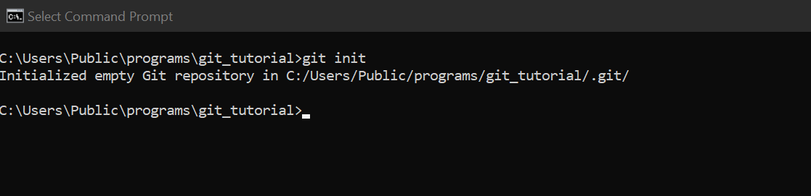

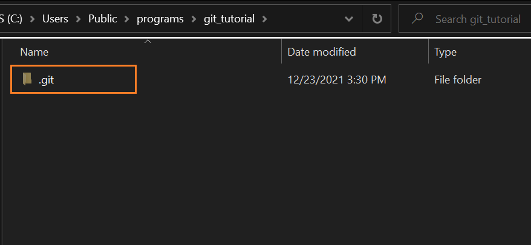

Sempre que inicializamos o git em um repositorio, é criado um arquivo do tipo ".git". É nesse arquivo que ficarão armazenados todas as informações necessárias para a realização do controle de versionamento.

## O COMANDO GIT STATUS

O comando `git status` é utilizado constantemente para verificar se existem novos commits a serem realizados. Basicamente ele te informara se existem arquivos no seu repositorio que foram alterados e ainda não passaram por um commit, ou se existem arquivos na "Staging Area", que nada mais são do que arquivos que foram adicionados pelo usuario para fazerem parte do proximo commit (ou ponto na historia).

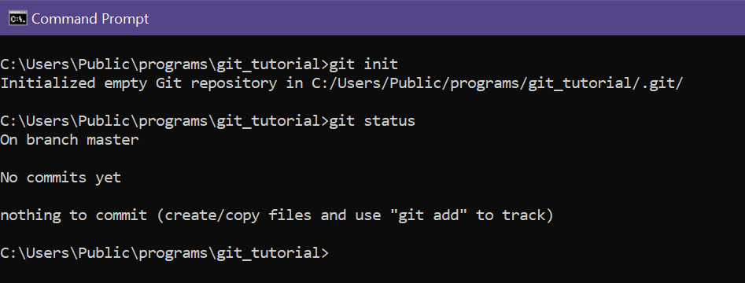

Como o nosso repositorio ainda não possui nenhum arquivo, o git status nos informou que além de nosso projeto ainda não possuir nenhum `commit`, não existem arquivos para serem "commitados".

Vamos agora adicionar um arquivo .txt e verificar novamente o `git status`.

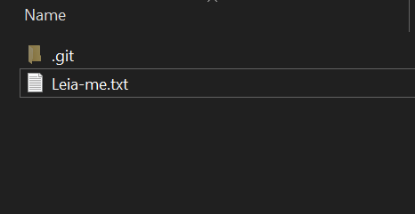

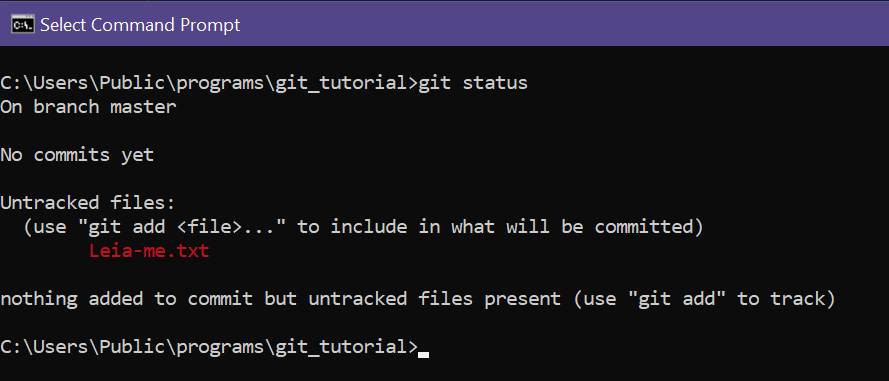

Agora, apesar de o nosso arquivo Leia-me estar em branco, o `git status` nos informa de que existem arquivos no nosso repositorio com informações que ainda não estão rastreadas.

## REALIZANDO O PRIMEIRO COMMITS

Para rastrear o novo arquivo que criamos em nosso diretorio, primeiro usaremos o comando `git add <nome do arquivo>` para adicionar nosso arquivo na Staging Area.

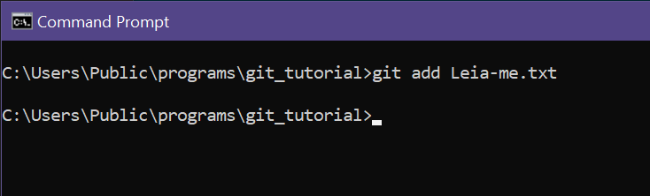

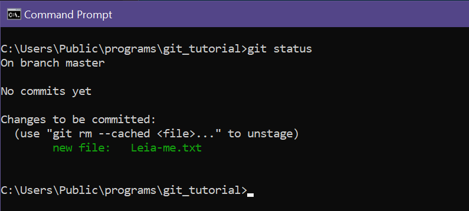

Agora quando utilizamos o comando `git status` somos informados de que existe um novo arquivo pronto para `commit` na Staging Area com alterações a serem rastreadas.

Vamos agora realizar o primeiro commit do nosso repositorio. Vamos utilizar o comando `git commit -m <"descrição do commit">`.

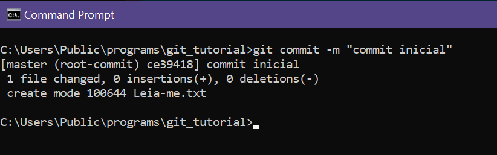

Agora, ao verificar o comando `git status`, somos informados que não existem mais alterações a serem rastreadas.

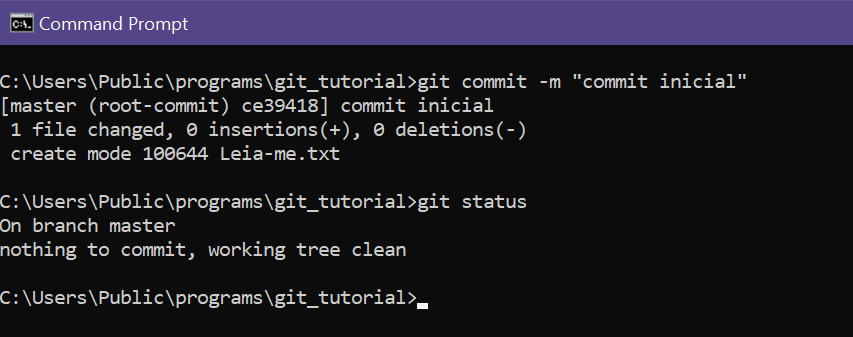

Para verificar o nosso historico de commits, utilizaremos o comando `git log`:

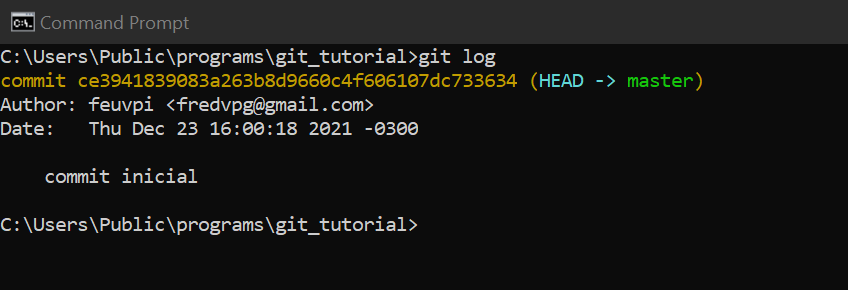

Podemos verificar que existe um `commit` realizado no nosso projeto (o que acabamos de realizar). É possivel verificar a data, o autor e a descrição do `commit`. Perceba que logo após o codigo do commit em amarelo, é indicado que o commit foi realizado direto no branch principal (master).

Antes de partimos para os branchs e para entendermos de uma vez a utilização dos comandos `git commit`, `git add` e `git status`, vamos incluir um texto qualquer no nosso arquivo .txt e vamos realizar um novo `commit`:

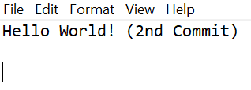

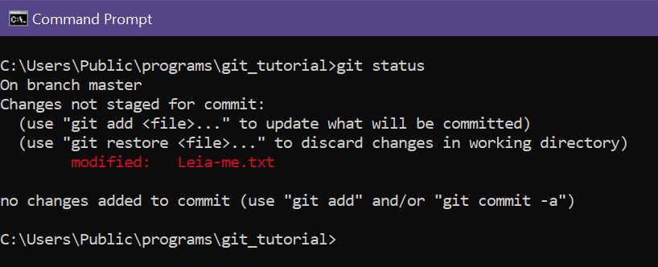

Agora o comando `git status` nos informa que existem alterações não rastreadas no nosso arquivo .txt. Clareou? Sempre que possuirmos arquivos em seu repositorio com alterações não rastreadas pelo git, o comando `git status` irá te informar. Agora vamos utilizar os comandos `git add` e `git commit` novamente e realizar nosso segundo `commit`.

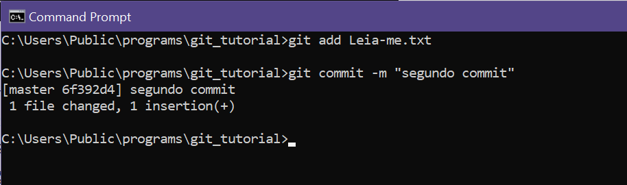

> **IMPORTANTE**: É importante inserimos nas descrições dos nossos commits quais foram as principais alterações introduzidas nos arquivos que estamos rastreando, de forma clara e objetiva. Pode ser algo como "realizado alteração 'A' para solucionar o problema 'B'". Isso será importante para que no futuro outros desenvolvedores e até nos mesmos possamos identificar as alterações realizadas.

## Entendendo o que são branches

Como descrito anteriormente, branches nada mais são do que "copias" do nosso diretoria que permitem-nos trabalhar no projeto sem que nossas alterações afetem os arquivos no "branch" principal (master). Desse modo, podemos realizar todas as alterações necessárias sem correr o risco de "bagunçar" o nosso projeto original, e apenas apos todas as alterações tiverem sido concluidas e devidamente testadas, realizarmos a junção dessas alterações com os arquivos originais.

A seguir, criaremos um novo `branch` em nosso projeto e então realizaremos uma alteração no nosso arquivo para em seguida realizar um `commit` no nosso novo branch e o `pull` para o `branch` principal.

Para criar um novo branch no seu projeto, utilize o comando `git branch <nome do novo branch>`, sem considerar os colchetes.

> **IMPORTANTE**: Ao criar um branch, não mudamos para ele automaticamente. Utilizaremos o comando `git checkout <new branch name>` para alterara para a nova ramificação.

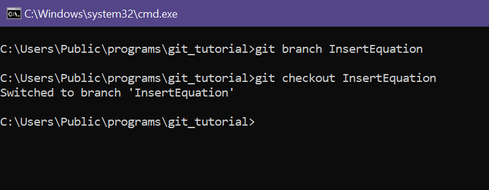

Agora ao usarmos o comando `git status` somos informados que estamos trabalhando no branch "InsertEquation" que acabamos de criar. Isso quer dizer que a partir de agora as alterações que realizarmos nos nossos arquivos não irão impactar o branch principal.

É importante notarmos ainda que como acabamos de realizar a mudança para a nova ramificação e não realizamos nenhum alteração, dessa forma o comando `git status` nos informa que não existem arquivos a serem rastreados.

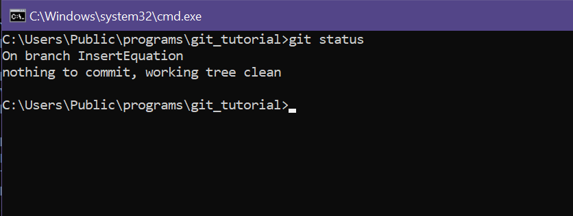

Agora vamos inserir uma equação no nosso arquivo .txt e realizar um commit no nosso novo branch.

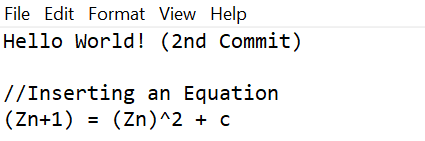

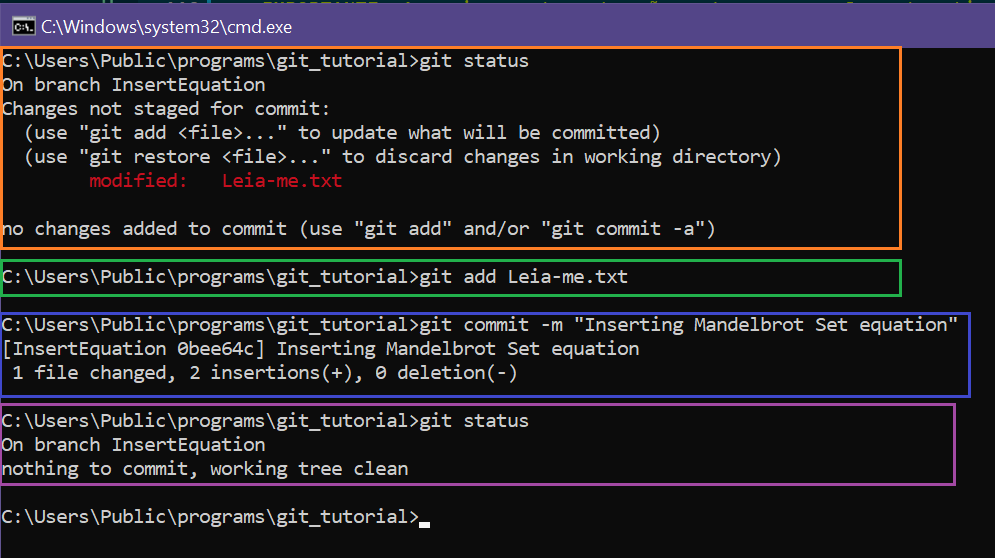

Agora vamos dar uma olhada no `git log` do nosso projeto.

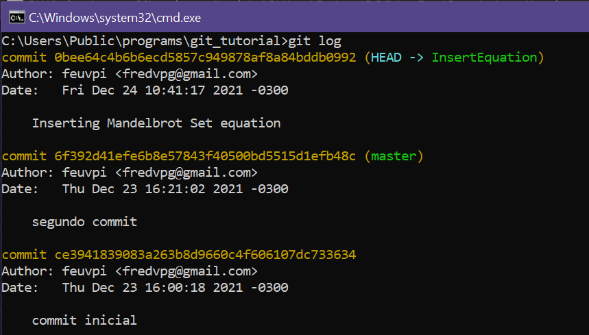

Ja é possivel visualizar o nosso terceiro `commit`, mas agora o log nos informa que o `commit` foi realizado no branch `InserEquation`.

Essas alterações ainda não estão no `branch` principal `master` e vamos poder verificar isso agora executando o comando `git checkout master` para voltarmos para o branch principal. Após isso, ao ao abrir o nosso arquivo .txt iremos perceber que a equação do MandelBrot Set que inserimos anteriormente não está mais la.

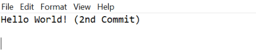

## Inserindo no branch principal as alterações realizadas na nova ramificação

Para finalizar esse post sobre como utilizar a ferramenta `git` para sistema de controle de versão, vamos agora realizar a junção ou "merge" das alterações que realizamos no nosso branch InsertEquation com o branch principal ou "master" utilizando o comando`git merge InsertEquation`

Perceba que agora, continuamos no `master branch` mas o arquivo .txt está atualizado com a equação do Mandelbrot Set que havia sido inserida na outra ramificação. Dessa forma podemos utilizar a ferramenta git em nossa maquina para realizar o controle de versão dos nossos projetos de forma profissional e eficiente.
